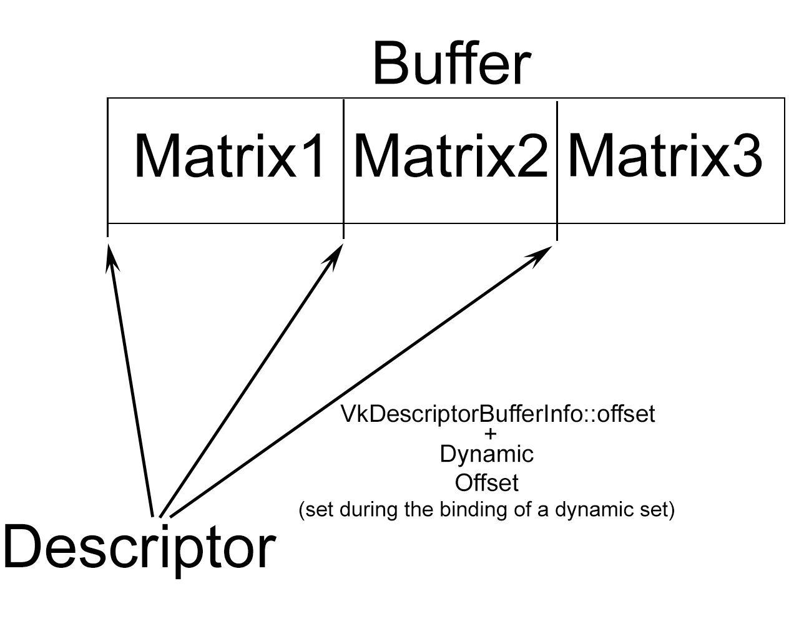

# Dynamic Descriptor Sets

Using one buffer containing matrices for several objects and one descriptor of **VK_DESCRIPTOR_TYPE_UNIFORM_BUFFER_DYNAMIC** type to access different parts of the buffer.
## Task

We want to draw three triangles, but in different positions, so we need to load different matrices for each triangle.
We have two simple options:  
1: Use three different buffers(one per matrix) and three different descriptors(one per buffer).  
2: Use one buffer which will contain three matrices and use three descriptors which will refer to different offsets in the buffer. These offsets have to be specified when writing the descriptor (in the **VkDescriptorBufferInfo** structure).  
These two options have disadvantages: (1) creating a lot of buffers is not good from performance point of view. (2) creating many descriptors for just one buffer is not good either, moreover we would have to overwrite the descriptor set to change the offsets.  
## Solution  
In Vulkan it is possible to create one descriptor with type **VK_DESCRIPTOR_TYPE_UNIFORM_BUFFER_DYNAMIC** which allows you to refer to one buffer, but by specifying the offset in it.  
The base offset calculated by the **VkDescriptorBufferInfo** when initially updating the descriptor set is added to a dynamic offset when binding the descriptor set.  
The only thing to consider is that the value of the dynamic offset must be a multiple of the **minUniformBufferOffsetAlignment** value from the device limits, since the GPU cannot read from any offset.  

